# Megapixel Groups ROI Calculator
Interactive Frontend Development Milestone Project @ Code Institute

This project is an investment calculator for calculating ROI (Return on Investment) built as a single page React application. 
It allows you to add businesses and campaigns, define your desired KPIs (Key Performance Indicators) and reap the results. 
It has a button the user can click to clear/reset the inputs that has been made. 
The application provides a contact form, social links (LinkedIn, Facebook, YouTube, Vimeo and Instagram), contact information and a link to Megapixels marketing services.
You can find the application [here](https://robinwesterback.github.io/deploy-react-app/).

## UX
The application is designed to represent Megapixel, following their brand and graphic guidelines.
It is designed to be user friendly, simple and clean with the purpose to present all information in a visually appealing manner on all devices.
It is made for marketers/investors who wants a quick and easy way to calculate the ROI of their investments as well as getting related metrics valuable to interested parties. 
They want a hasslefree experience using the tool. If problem should arise it should be easy to get in touch with the owner of the application.
To provide that information this application is a simple and straightforward single-page-application with 5 major sections - Home, Business, Campaign, ROI and Support.
The support section provides a contact form, social links (LinkedIn, Facebook, YouTube, Vimeo and Instagram), contact information and a link to Megapixels marketing services.

### User Stories
The user stories are showing pictures from an earlier stage of the project and not the deployed version. 
You can access the deployed project [here](https://robinwesterback.github.io/deploy-react-app/) to try the user stories yourself.

As a user, I want to click on a navigation link - 
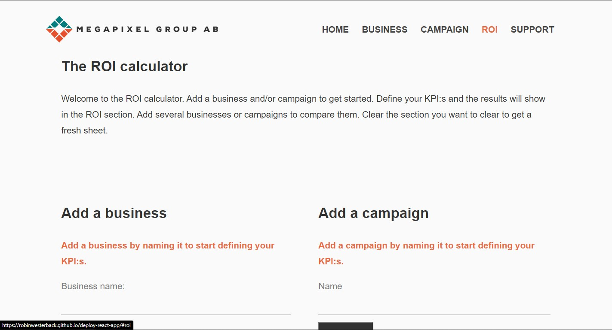 

So that I can get navigated towards the desired link location.
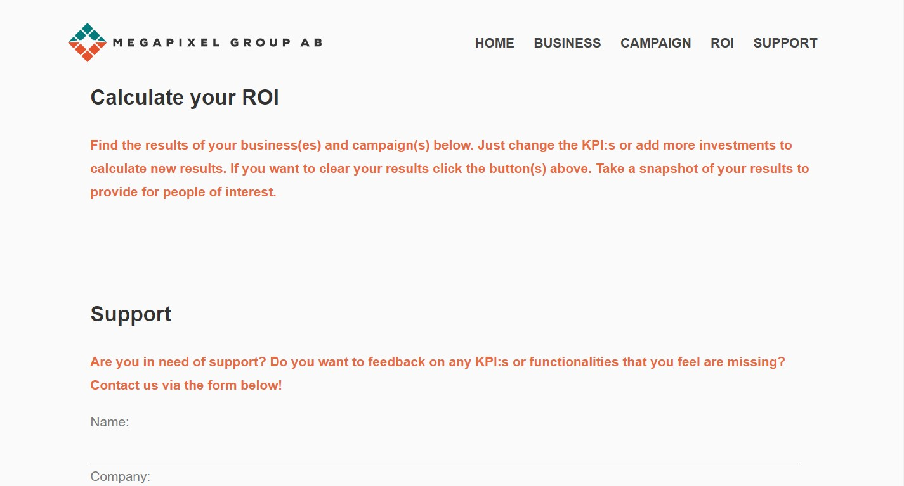

As a user, I want to add a business and a campaign -
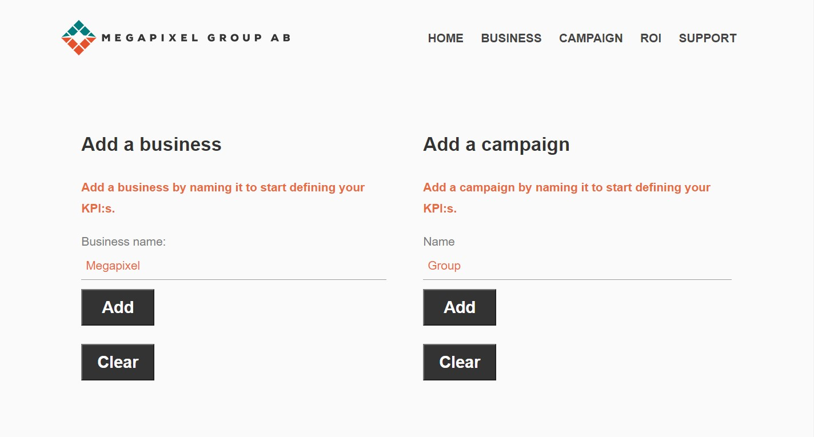 

So that I can fill in my KPIs.
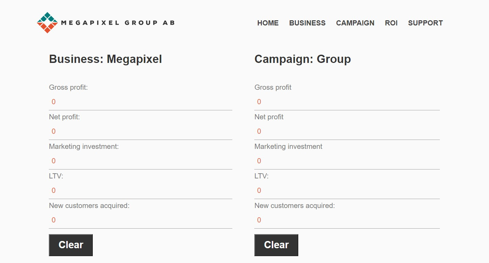

As a user, I want to know why I can't add multiple businesses -
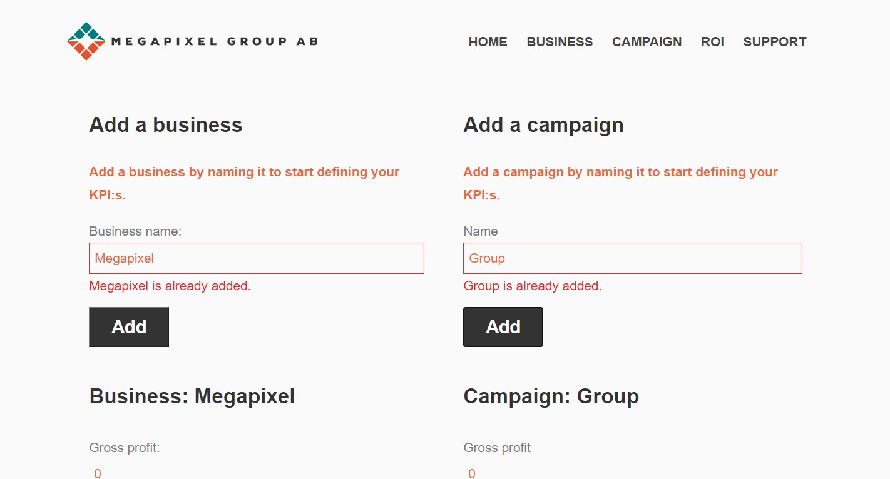 

So that I can adress the issue. 
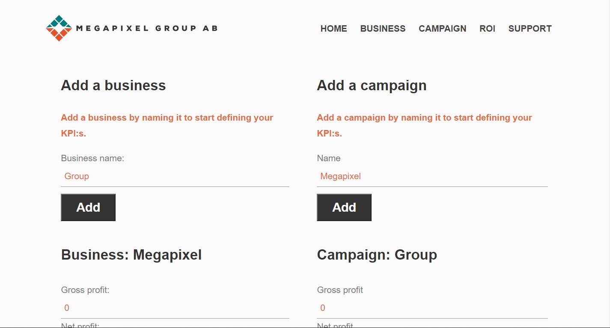

As a user, I want to know to clear the business and campaign sections - 
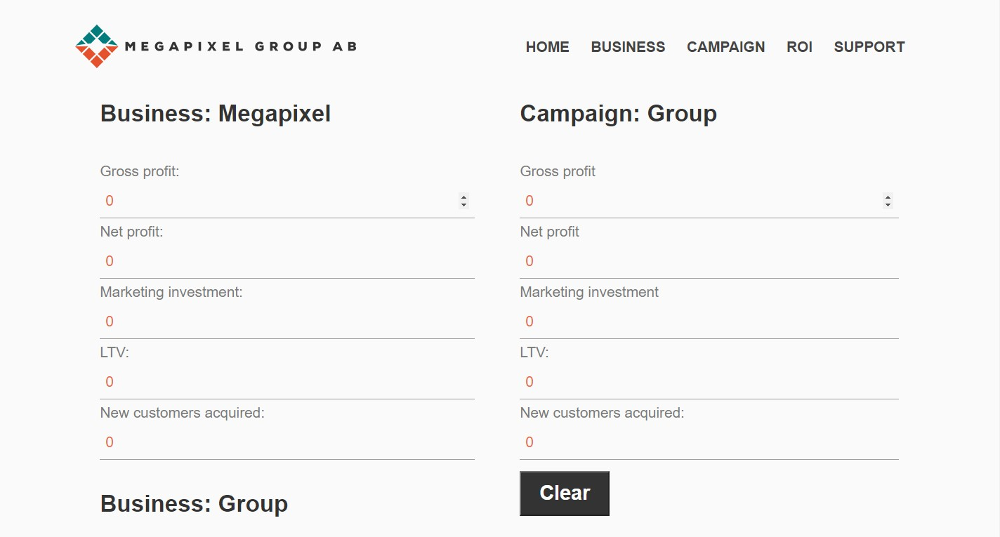 

So that I can work from a clean sheet.
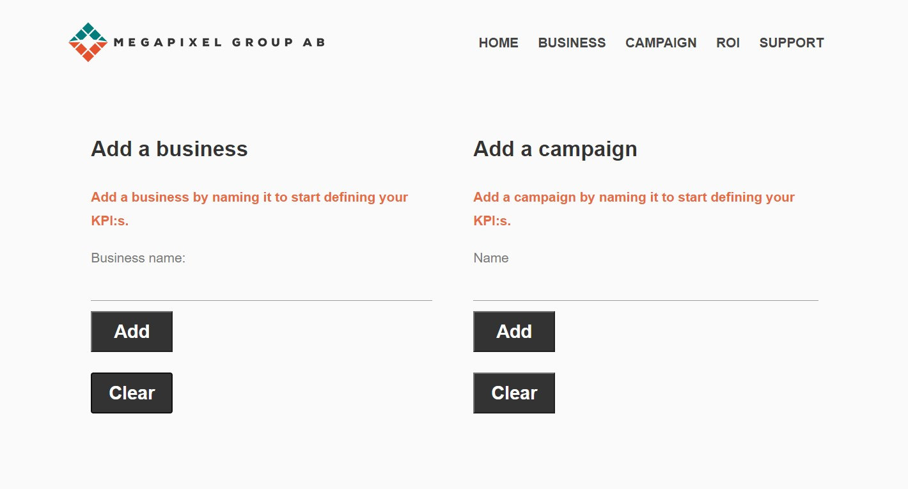

As a user, I want to know to fill in my KPIs -
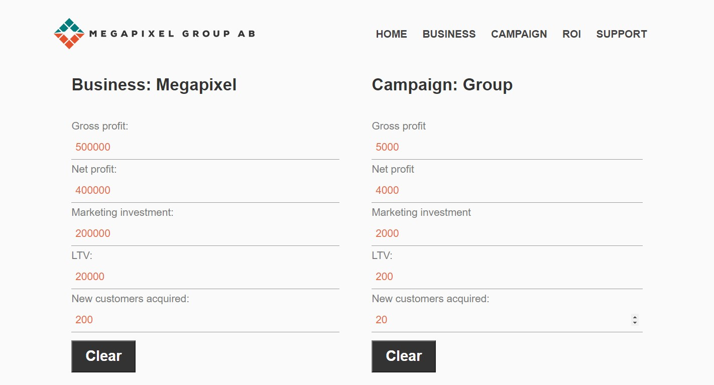 

So that I can get the results. 
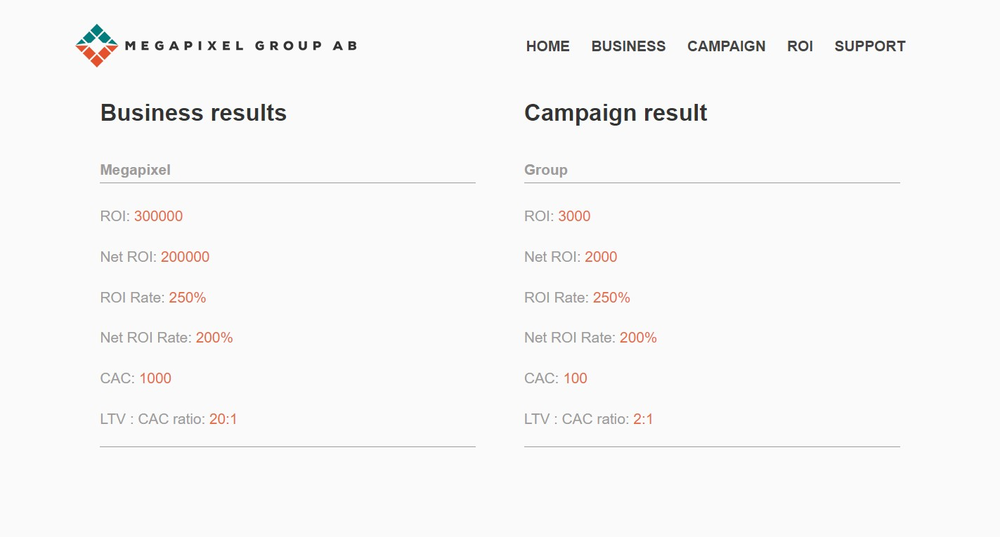

As a user, I want to be able to contact the support -
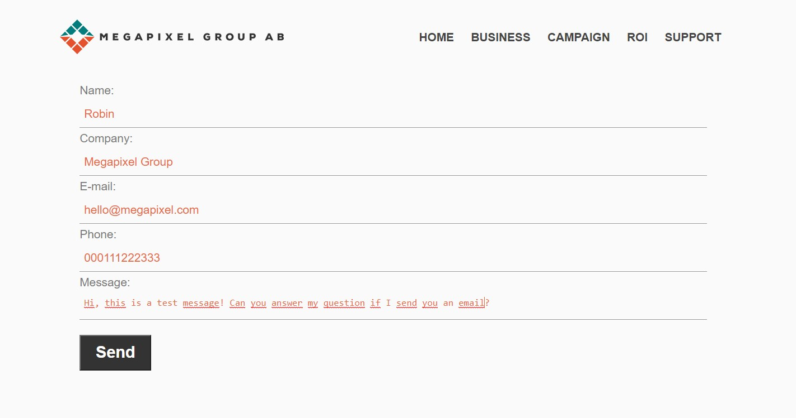 

To get help answering the question I have.
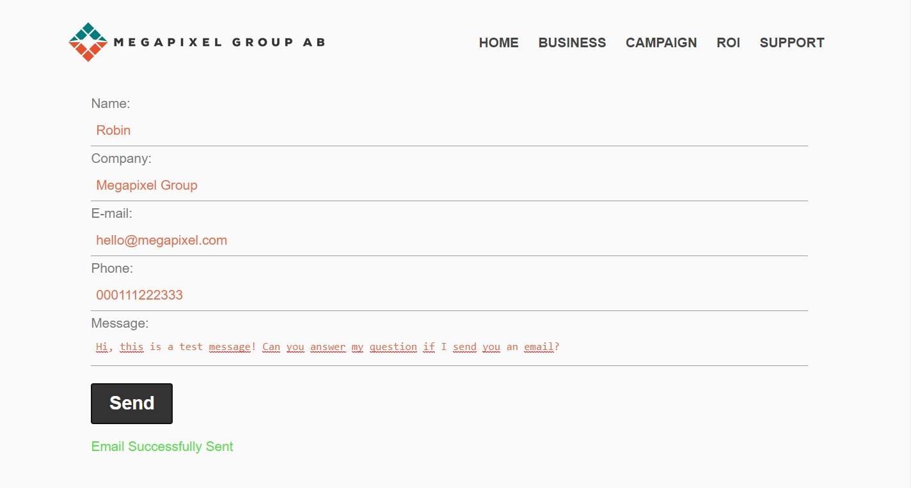

As a user, I want to get information (social links, contact info etc.) about the owner of the site, so that I can contact the owner if I want to.
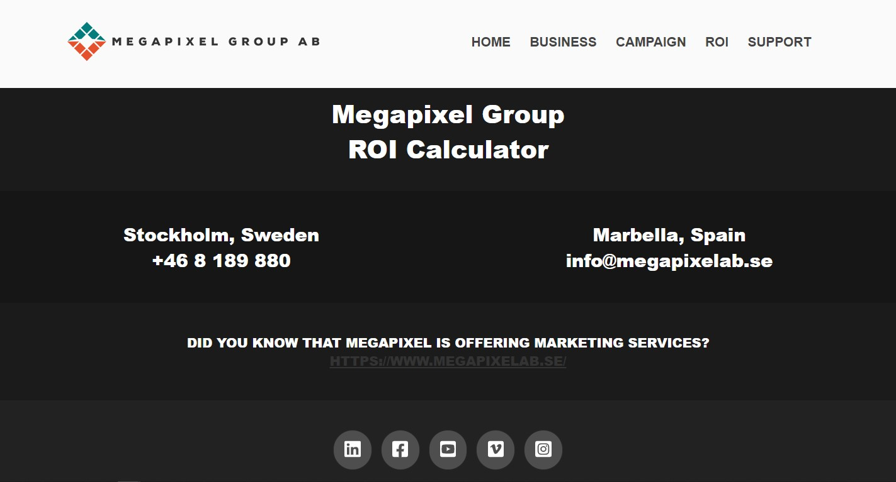

### Strategy
The goal with the application is to provide quick and easy access to the functions, tools and recourses it provides.
The design should fit the purpose and follow Megapixels brand and graphic guidelines. 
The foundation of the application should be solid with room for improvement for future updates/releases.

### Scope
The users should be able to use a fully functioning application for calculating ROI including support if needed.
At this stage the user will experience a running application with the possibility to contact the owner with feedback for future releases.
Future releases may introduce:
 A wider range of KPIs and results
 The possibility to compare results to eachother
 Provide more information and resources about ROI and KPIs

### Structure
The application has a natural structure with the "home-section" giving a message, in this case welcoming the user to the application and describes how to use it. 
The next section is the "business-section", where you can add a businesses and define your KPIs.
The next section is the "campaign-section", where you can add a campaign and define your KPIs.
The result section follows where you can reap the results of your investments.
At the end of the application is the "support-section" with a contact form and a footer where you can access social-links, contact-info and a link to Megapixels marketing services.

### Skeleton
In this [link](https://github.com/robinwesterback/deploy-react-app/tree/master/src/wireframes) you can find the wireframes for each section that serves as the skeleton for the project.

### Surface
In this [link](https://www.megapixelab.se/) you can find Megapixels website. 
This application follows Megapixels brand and graphic guidelines.
The white background works well with the logo, buttons and font colors. 
The design is clean and the orange color presents the information in a pleasant way.

## Features
The application contains several features with a few left to be implemented.

### Existing Features

#### Hamburger drop down menu
A function that uses Reacts useState to change the state of the element onClick.
Find out more about Reacts useState [here](https://reactjs.org/docs/hooks-state.html "Using the State Hook").
The design is made to follow Megapixels brand and graphic guidelines.

#### ROI Calculator
An ROI calculator that is used for businesses and campaigns in this project. 
The calculator contains several variables, runs functions, passes and stores information.
You can add a new business or campaign, enter the KPIs that you want and get the results in an instant. 
The calculator is built using hooks. 
Find out more about hooks [here](https://reactjs.org/docs/hooks-reference.html "Hooks API Reference").

##### Get business/campaign
Gets the name of all the items in every business/campaign.

##### Clear
Empties the values of the form, result and business/campaign.

##### Calculate result
Calculates the result of the inserted KPIs and updates the result.

##### Add business/campaign
Adds a business/campaign that have pre-defined KPIs that can be filled in with desired KPIs.

##### On form changed
When the form is changed the results are updated automatically.

#### Send email
I use emailjs to let the user send emails to the site owner. 
I used the information from [emailjs](https://www.emailjs.com/docs/examples/reactjs/ "EmailJS + React") to make it work.  
The user get notified wether it was a success or of it failed.

#### Links
I provide several links on the application for navigation in the header and footer.

### Features Left to Implement

#### More options to the calculator
A wider range of KPIs and results. The possibility to compare results to eachother and show visually appealing results.

#### Recourses and content
Provide more information and resources about ROI and KPIs. Also add images, videos and make the application more visually appealing where appropriate.
Add questionmarks that shows helpful information on hover.

#### Smooth Interactive design
Add transitional times for hover effects etc. to make the experience slicker.

#### Better browser compability
When needed, make the application more compatible with browsers other than Chrome.

#### 404 error
I want to customize the 404 error webpage.

#### Livechat
I might add a live-chat or integrate one from Pipedrive to provide additional ways of communicating with me.

#### Your thoughts
Are there any features that you would like me to implement to improve the application? Please get in touch and share your thoughts.

## Technologies Used
I used HTML, CSS and Javascript in this project. I decided to use the React framework and created a react app. 
As I'm done with the first version of this project I'm happy that I chose to build a single page application in React.
It will be easy to implement future releases and continue to develop the functions the app provides.

### HTML
This project uses semantic [HTML](https://html.com/ "HTML") to improve SEO and user friendliness. 
The HTML is rendered from jsx-files in this React app. 

### CSS
The project uses responsive design to improve the user experience and availability on all devices. 
The [CSS](https://www.w3.org/Style/CSS/Overview.en.html "CSS") is separated using comments. 
I have a [reset stylesheet](https://cssreset.com/scripts/eric-meyer-reset-css/ "CSS Reset") to reduce browser 
inconsistencies in things like default line heights, margins and font sizes of headings, and so on. 

### JS
I used [JavaScript](https://www.javascript.com/ "JavaScript") for all the functions and interactivity on the application. 
Comments are provided to give an explanation of the functions. 

### React
I used [React](https://reactjs.org/ "React") as a framework for all the functions and states. 
React is a JavaScript library that builds user interfaces for single-page applications by dividing UI into composable components.
Businesses that use ReactJS are assured of better performance compared to those that use other frameworks. 
Because ReactJS helps to prevent updating of DOM, it means that the apps will be faster and deliver better UX. 
ReactJS was designed to help improve the total rendered pages from the website server.

## Testing
I have tested the application and looked for flaws in the design and errors in the functionality on several browsers on desktop, laptop and iPhone 7.
I have also tested the user stories to see if the application fills its purpose towards the user. 
The expected outcome is that the application is responsive and functional on all browsers/devices. 
Functions like links, overlay menu and contact form should work properly e.g "target=”_blank"" where appropriate. Below are my findings and comments.

### Functionality

| Description   | Expected outcome | Pass | Comments |
| ------------- |:----------------:| ----:| --------:|
| Input 30 letters in Campaign name | Max input of 25 letters | Yes | - |
| Add a business without a name | Shouldn't work, "fill this field" should pop up | Yes | - |
| Send an empty contact form | Shouldn't work, fields are required | Yes | - |

### User Stories

| Description   | Expected outcome | Pass | Comments |
| ------------- |:----------------:| ----:| --------:|
| Click on a navigation link | Get navigated towards the desired link location | Yes | - |
| Click on add business | A new business is added | Yes | - |
| Add a business with the same name | It doesn't work and an error-message pops up | Yes | - |
| Click on clear in the business section | Clears the business section | Yes | - |
| Fill in KPIs on a business | Results shown in the result section | Yes | - |
| Send a message from the contact form | Message gets sent | Yes | - |

### Different Browsers and devices

#### Desktop

| Description   | Expected outcome | Pass | Comments |
| ------------- |:----------------:| ----:| --------:|
| Internet Explorer | The application works appropriately | No | Paddings and margins doesn't work accordingly which ruins the design |
| Google Chrome | The application works appropriately | Yes | - |
| Mozilla Firefox | The application works appropriately | Yes | Everything works perfectly, I noticed that the paddings didn't work exactly the same though. When you use the navigation links you get navigated below the header. |
| Safari | The application works appropriately | Yes | - |

#### Mobile

| Description   | Expected outcome | Pass | Comments |
| ------------- |:----------------:| ----:| --------:|
| Google Chrome | The application works appropriately | Yes | I noticed the bars in the hamburger menu were a little out of place |
| Safari | The application works appropriately | Yes | I noticed the bars in the hamburger menu were a little out of place |

### Responsiveness

I have tested the responsiveness of the website [here](http://ami.responsivedesign.is/# "Am I Responsive?") and it is responsive.

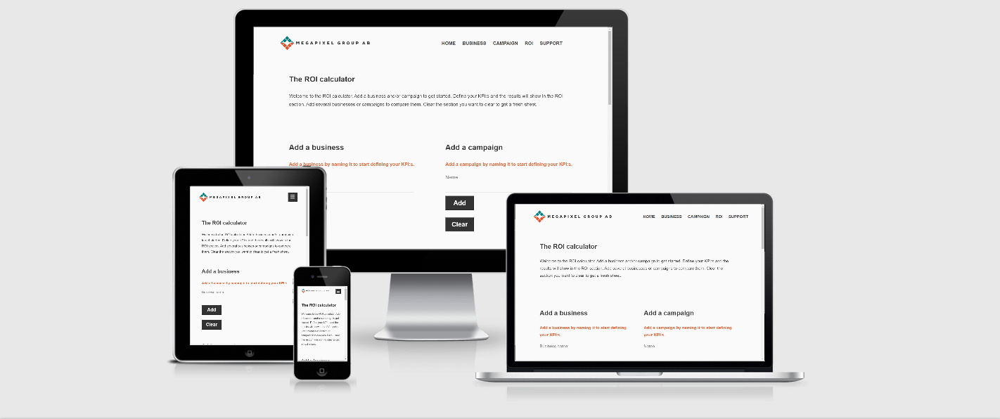

### Code validation

#### CSS
I validated my CSS with the [Jigsaw W3C Validation Service](https://jigsaw.w3.org/css-validator/ "CSS Validation"). 
I got 8 errors regarding that the property `padding-inline-start`, `margin-block-end` and `margin-block-start` doesn't exist.
I found this [information](https://developer.mozilla.org/en-US/docs/Web/CSS/padding-inline-start "Padding inline start on Mozilla") regarding the issue. 
The CSS does make a positive difference in the design of the application as I have tested this. 
Therefore I choose to keep it even though jigsaw regards the CSS as an error.

#### HTML
I validated my HTML with the [W3C Markup Validation Service](https://validator.w3.org/ "HTML Validator") with no errors or warnings to show.

#### JS
I ran my JavaScript through a linter, [ESLint](https://eslint.org/ "JavaScript Linter"), with no major issues. 
You can run ESLint on any file or directory like this: `$ npx eslint yourfile.js`.
Errors found was e.g 'title' is missing in props validation which isn't required for the application to function correctly.
You can find more information about the issue [here](https://reactjs.org/docs/typechecking-with-proptypes.html?fbclid=IwAR0AgCEmLxhljebWPsYkhHBDVy1kwrKnd1g-jO7qma4Q1GttPOnfdfAa2bo "Typechecking with PropTypes")

### Defensive design
I've implemented defensive designs throughout the application. Fields are required before submitting. 
`maxLength` is applied to `input` fields. Error messages pops up where appropriate. 
Email confirmation message pops up after successfully sent email. 
There are more defensive design you can add to improve the user experience,
such as adding interactive questionmarks that provide relevant information.

### Conclusion
After testing the deployed application my overall conclusion is that the application is working as intended. 
It has a lot of potential to provide even more value for the user with future installations of the application.
The minor flaws that exist don’t ruin the user experience but should be corrected in the future.

## Deployment
I followed this [guide](https://github.com/gitname/react-gh-pages "Deploy React to GitHub Pages") to create and deploy the react app to GitHub Pages.
Now you can deploy the project typing `$ npm run deploy`.

1. Use this [link](https://github.com/robinwesterback/deploy-react-app/ "Deploy React App Repository") to get to the projects repository.

2. Click "Clone or Download".

3. Click the "copy" icon.

4. Open Git Bash in your local IDE.

5. Change your current working directory to where you want the cloned directory to be made.

6. Type `$ git clone` and then paste the URL you copied earlier - like this `$ git clone URL`.

7. When you press enter your local clone will be ready.

## Credits

### Content
All content on the application was written by me. 
The design was inspired by [Megapixel Groups](https://www.megapixelab.se/ "Megapixel Group") brand and graphic guidelines.

### Media
The logo used for this project was delivered by [Megapixel Group](https://www.megapixel.group/ "Megapixel Group") and.
The Favicon was generated [here](https://realfavicongenerator.net/ "Favicon").

### Acknowledgements
Below is a list of the resources used to create this project:

- [Deploying a React App to GitHub Pages](https://github.com/gitname/react-gh-pages "Create React App and deploy to GitHub Pages")
- [React](https://reactjs.org/ "React")
- [React Tutorial](https://reactjs.org/tutorial/tutorial.html#before-we-start-the-tutorial "React Tutorial")
- [React Fundamentals](https://reactnative.dev/docs/intro-react "React Fundamentals")
- [React Custom Hooks](https://reactjs.org/docs/hooks-custom.html "React Custom Hooks")
- [Using the State Hook](https://reactjs.org/docs/hooks-state.html "Using the State Hook")
- [Hooks API Reference](https://reactjs.org/docs/hooks-reference.html "Hooks API Reference")
- [EmailJS and React](https://www.emailjs.com/docs/examples/reactjs/ "EmailJS and React")
- [Eric Meyers Reset](https://cssreset.com/scripts/eric-meyer-reset-css/ "Eric Meyers Reset")